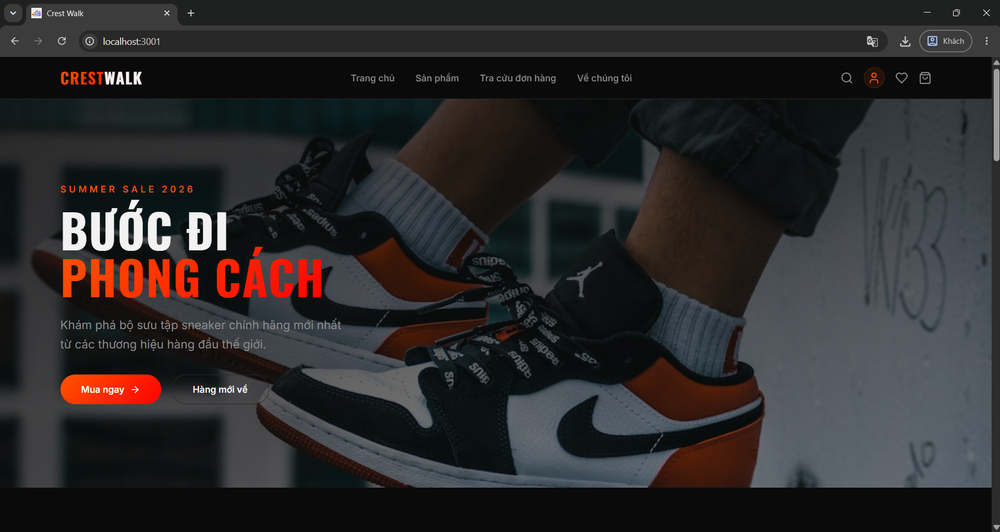
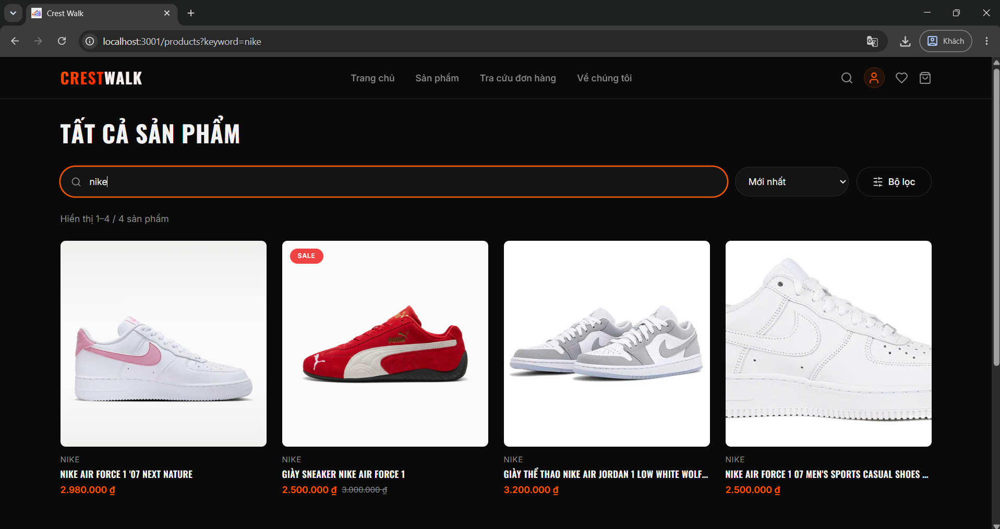
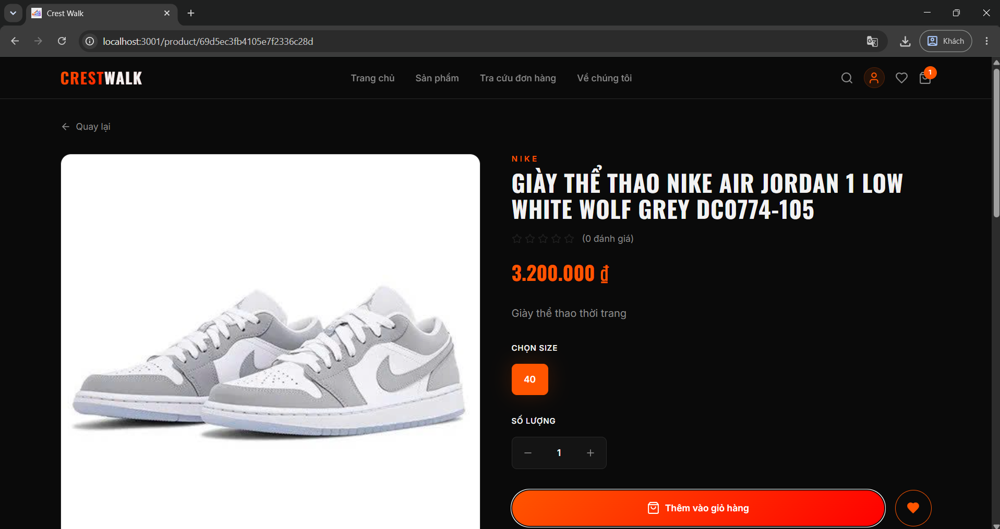
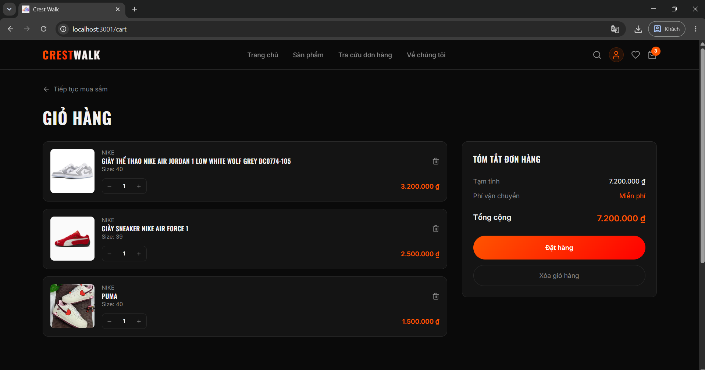
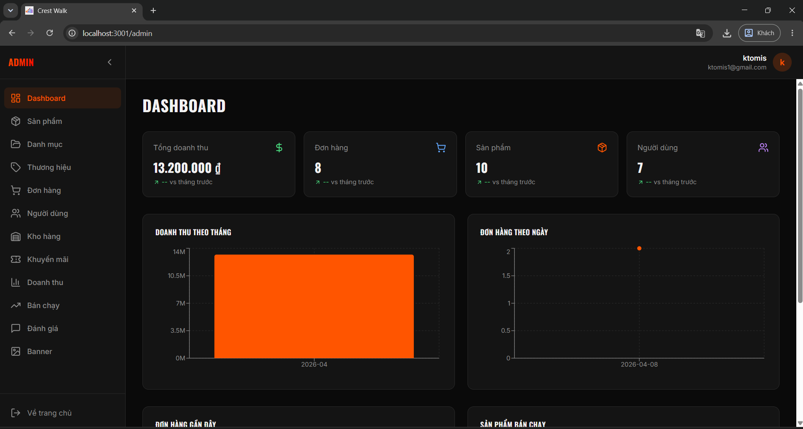
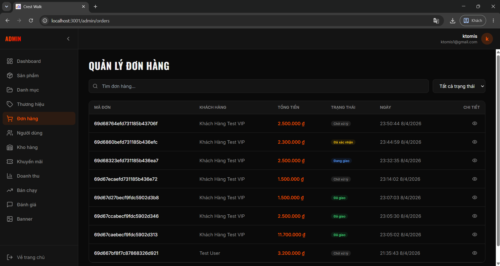
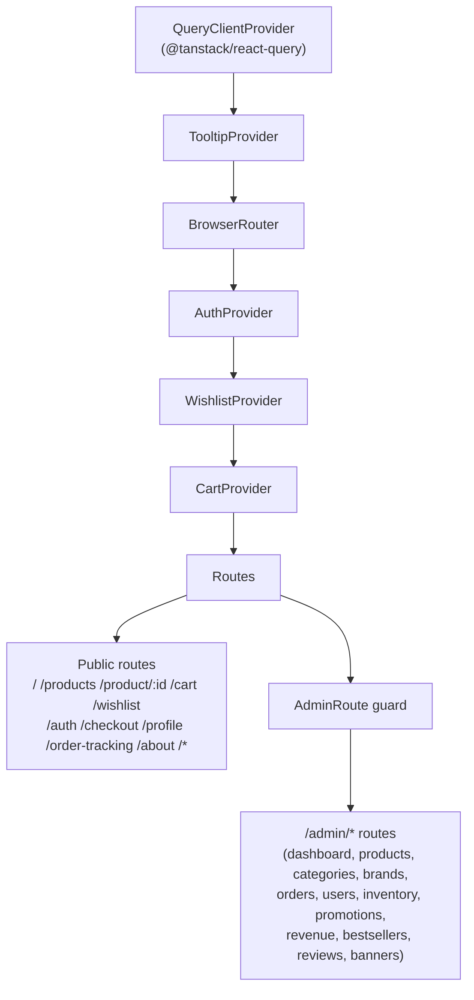
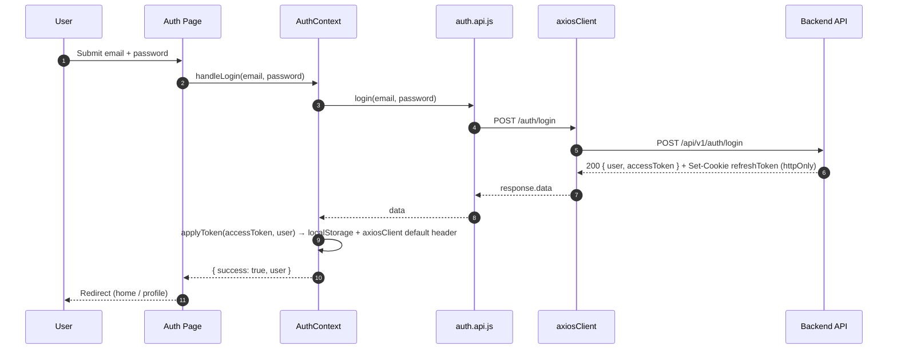
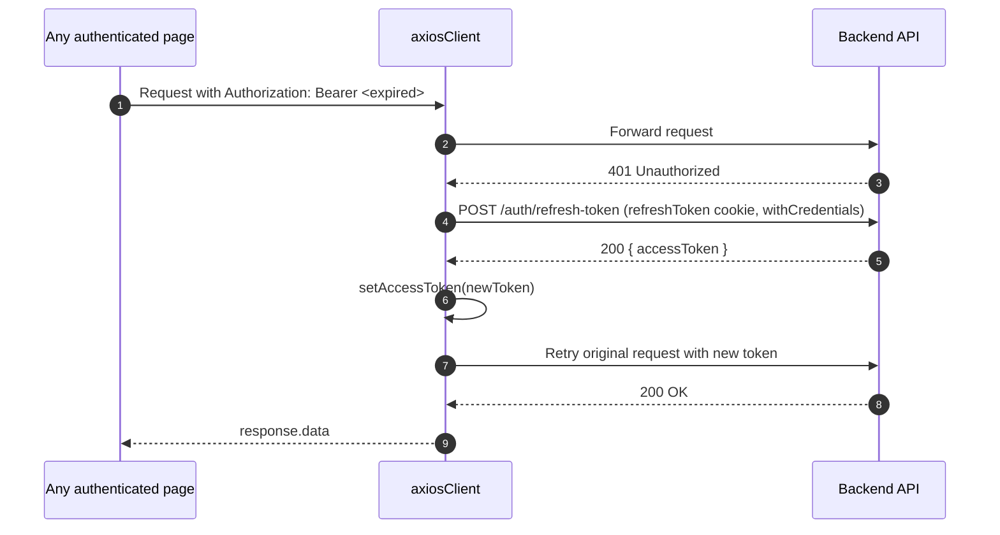
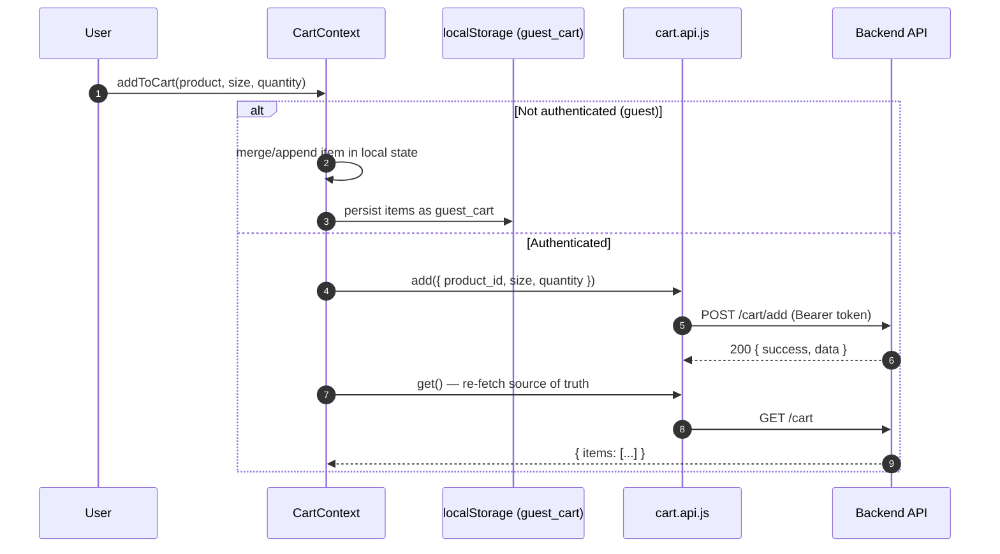

<p align="center">
  
</p>

<h1 align="center">Crest Walk</h1>

<p align="center">
  <strong>A modern React storefront and admin dashboard for a sneaker/shoe e-commerce platform, built with Vite, React 18, Tailwind CSS, and shadcn/ui.</strong>
</p>
<p align="center">
  <em>This repository is the <strong>frontend-only</strong> client of the Crest Walk platform. It renders the public storefront (catalog, product detail, cart, wishlist, checkout, order tracking) and a role-guarded admin dashboard (products, categories, brands, inventory, orders, users, promotions, reviews, banners, revenue & bestseller analytics), talking to a separate backend REST API over JWT-authenticated HTTP.</em>
</p>

<p align="center">
  <a href="https://react.dev/"></a>
  <a href="https://vitejs.dev/"></a>
  <a href="https://tailwindcss.com/"></a>
  <a href="https://ui.shadcn.com/"></a>
  <a href="https://tanstack.com/query"></a>
  <a href="https://reactrouter.com/"></a>
  <a href="https://axios-http.com/"></a>
  <a href="https://vitest.dev/"></a>
  <a href="LICENSE"></a>
</p>

## 📚 Table of Contents

- [Overview](#-overview) — preview & key features
- [Tech & Architecture](#-tech--architecture) — stack, folder layout, providers, routes, runtime flows
- [Getting Started](#-getting-started) — install, configure, run, test, build
- [API Reference](#-api-reference) — the backend contract this app consumes
- [Project Info](#-project-info) — author, contact, license

---

## 🖼️ Overview

### Preview

|                 <br/>**Home**                  |  <br/>**Product Catalog**  |
| :------------------------------------------------------------------------------: | :------------------------------------------------------------------: |
|  <br/>**Product Detail**   |      <br/>**Cart & Checkout**      |
| <br/>**Admin Dashboard** | <br/>**Admin Table** |

---

### Key Features

- **Storefront**
  - Home, product catalog with search/filtering, product detail with variants (size), reviews, and related items.
  - Guest-friendly shopping: cart and wishlist work before login, then merge into the account experience after authentication.
  - Checkout, order placement, and order-tracking/history lookup.
- **Authentication & Session**
  - JWT access token (kept in memory + `localStorage`) with an **httpOnly refresh-token cookie** issued by the backend.
  - Silent token refresh: an Axios response interceptor transparently retries a request once after a `401`, using `POST /auth/refresh-token`.
  - Session restored automatically on page reload from `localStorage`.
- **Cart & Wishlist**
  - **Dual-mode cart** (`CartContext`): unauthenticated users get a `localStorage`-backed `guest_cart`; authenticated users are synced live against the backend cart API on every mutation.
  - Wishlist is server-synced and requires authentication, with optimistic toggle helpers (`isInWishlist`, `toggleWishlist`).
- **Role-Based Admin Dashboard**
  - `AdminRoute` route guard redirects non-admins away from `/admin/*` and shows a toast notice.
  - Full CRUD screens for Products, Categories, Brands, Inventory, Orders, Users, Promotions (vouchers), Reviews (moderation), and Banners.
  - Analytics screens for Revenue and Bestsellers.
  - Shared `AdminLayout` shell and `AdminPaginationBar` component reused across every admin list screen.
- **UI System**
  - Built on **shadcn/ui** (Radix UI primitives + Tailwind), generated/configured via `components.json`, giving accessible dialogs, dropdowns, forms, tables, sidebars, carousels, toasts, tooltips, and charts out of the box.
  - Toast notifications via both `sonner` and the shadcn `Toaster`.
- **Resilient API Layer**
  - One dedicated Axios-based client module per backend resource under `src/api/`, so each screen imports a small, typed surface instead of calling Axios directly.
  - Shared helpers normalize paginated list responses (`normalizeListPagination.js`) and Axios error payloads (`formatApiErrorMessage.js`) so every screen handles loading/error/pagination the same way.

---

## 🛠️ Tech & Architecture

### Tech Stack & Key Libraries

- **Framework & Build**: React 18, Vite 5 (`@vitejs/plugin-react-swc`), path alias `@` → `src/`
- **Language**: JavaScript (JSX); Vitest config in TypeScript
- **Styling & UI**: Tailwind CSS, `tailwindcss-animate`, shadcn/ui, Radix UI primitives, `lucide-react` icons, `class-variance-authority`, `clsx` / `tailwind-merge`
- **Routing**: React Router DOM 6 (`BrowserRouter`, nested `<Route>`, guarded admin subtree)
- **Server State**: `@tanstack/react-query` (`QueryClientProvider`)
- **Client/Global State**: React Context (`AuthContext`, `CartContext`, `WishlistContext`)
- **HTTP**: Axios with request/response interceptors for auth headers and silent token refresh
- **Forms & Validation**: `react-hook-form`, `@hookform/resolvers`, `zod`
- **Other UX libraries**: `framer-motion`, `embla-carousel-react`, `recharts` (admin analytics charts), `date-fns`, `sonner`, `next-themes`, `cmdk`, `vaul`, `react-day-picker`, `input-otp`, `react-resizable-panels`
- **Testing**: Vitest, `@testing-library/react`, `@testing-library/jest-dom`, `jsdom`
- **Tooling**: ESLint 9 (flat config), PostCSS, Autoprefixer

---

### Project Structure

```text
crest-walk-fe/
├── public/                  # Static assets (favicon, robots.txt, images)
├── docs/screenshots/        # (create this) preview images referenced by this README
├── src/
│   ├── api/                 # One Axios client per backend resource (public + admin*), plus axiosClient.js
│   │                         # — the configured instance with auth headers & silent token refresh
│   ├── components/          # Shared UI: Header, Footer, Layout, AdminLayout, AdminRoute guard, ProductCard
│   │   └── ui/                  # shadcn/ui primitives (button, dialog, table, sidebar, toast, ...)
│   ├── config/               # Runtime config (API_URL from VITE_API_URL)
│   ├── contexts/             # AuthContext, CartContext (guest + synced), WishlistContext
│   ├── data/                 # Static/demo fixtures for local UI development
│   ├── hooks/                 # use-mobile, use-toast
│   ├── lib/                   # utils (cn), pagination/error/auth-response normalizers
│   ├── pages/                 # One page per route (Home, Products, Cart, Checkout, ...)
│   │   └── admin/                # Admin-only pages, mounted under the <AdminRoute> guard
│   ├── test/                  # Vitest setup + sample test
│   ├── App.jsx                # Route table + global provider tree (see diagram below)
│   └── main.jsx                # React DOM entry point
├── vite.config.js / vitest.config.ts / eslint.config.js / tailwind.config.js
├── index.html                # Vite HTML entry
└── package.json
```

### Application Architecture

#### Provider composition (`src/App.jsx`)



#### Route map

| Path                 | Page               | Notes                       |
| :------------------- | :----------------- | :-------------------------- |
| `/`                  | `Index`            | Home / landing              |
| `/products`          | `Products`         | Catalog, search & filters   |
| `/product/:id`       | `ProductDetail`    | Detail, variants, reviews   |
| `/cart`              | `Cart`             | Guest or server-synced cart |
| `/wishlist`          | `Wishlist`         | Requires login to persist   |
| `/auth`              | `Auth`             | Login / Register            |
| `/checkout`          | `Checkout`         | Order placement             |
| `/profile`           | `Profile`          | Account settings            |
| `/order-tracking`    | `OrderTracking`    | Order history / lookup      |
| `/about`             | `About`            | About page                  |
| `*`                  | `NotFound`         | 404 fallback                |
| `/admin`             | `AdminDashboard`   | 🔒 admin only               |
| `/admin/products`    | `AdminProducts`    | 🔒 admin only               |
| `/admin/categories`  | `AdminCategories`  | 🔒 admin only               |
| `/admin/brands`      | `AdminBrands`      | 🔒 admin only               |
| `/admin/orders`      | `AdminOrders`      | 🔒 admin only               |
| `/admin/users`       | `AdminUsers`       | 🔒 admin only               |
| `/admin/inventory`   | `AdminInventory`   | 🔒 admin only               |
| `/admin/promotions`  | `AdminPromotions`  | 🔒 admin only               |
| `/admin/revenue`     | `AdminRevenue`     | 🔒 admin only               |
| `/admin/bestsellers` | `AdminBestsellers` | 🔒 admin only               |
| `/admin/reviews`     | `AdminReviews`     | 🔒 admin only               |
| `/admin/banners`     | `AdminBanners`     | 🔒 admin only               |

> 🔒 Everything under `/admin` is nested inside `<Route element={<AdminRoute />}>`, which renders an `<Outlet />` only when `isAuthenticated && user.role === "admin"`; otherwise it redirects to `/`.

<details>
<summary><b>🧩 Click to expand key runtime flows (Auth, Silent Refresh, Cart)</b></summary>

##### 1. Login flow



##### 2. Silent access-token refresh (Axios interceptor)



##### 3. Add-to-cart (guest vs. authenticated)



</details>

---

## 🚀 Getting Started

1. **Clone the repository**

   ```bash
   git clone https://github.com/MT-KS-04/crest-walk-fe.git
   cd crest-walk-fe
   ```

2. **Install dependencies**

   ```bash
   npm install
   # or: bun install
   ```

3. **Configure environment variables**

   Create a `.env` file in the project root:

   ```env
   # Base URL of the backend REST API (must include /api/v1)
   VITE_API_URL=http://localhost:3000/api/v1
   ```

   > If `VITE_API_URL` is not set, `src/config/index.config.js` falls back to `http://localhost:8080/api/v1`. Make sure this matches wherever your backend (`crest-walk-api`) is actually running.

4. **Run the dev server**

   ```bash
   npm run dev
   ```

   The app is served at `http://localhost:3000` (configured in `vite.config.js`).

5. **Lint**

   ```bash
   npm run lint
   ```

6. **Run tests**

   ```bash
   npm run test        # single run (Vitest)
   npm run test:watch  # watch mode
   ```

7. **Production build & preview**

   ```bash
   npm run build        # production build → dist/
   npm run build:dev    # build in development mode (unminified, for debugging)
   npm run preview      # serve the built dist/ locally
   ```

---

## 📡 API Reference

This repository has no server code — every screen calls a separate backend (`VITE_API_URL`, versioned under `/api/v1`) through the clients in `src/api/`. Summary of the contract this frontend integrates against:

### Auth (`/auth`)

| Method | Endpoint                                         | Access       | Notes                               |
| :----- | :----------------------------------------------- | :----------- | :---------------------------------- |
| `GET`  | `/auth/me`                                       | Bearer token | Current user profile                |
| `POST` | `/auth/register`                                 | Public       | `{ email, password, role? }`        |
| `POST` | `/auth/login`                                    | Public       | Sets `refreshToken` httpOnly cookie |
| `POST` | `/auth/refresh-token`                            | Cookie       | Requires `refreshToken` cookie      |
| `POST` | `/auth/forgot-password` / `/auth/reset-password` | Public       | Password reset flow                 |

### Storefront (public / user)

| Method                      | Endpoint                                                             | Access                            |
| :-------------------------- | :------------------------------------------------------------------- | :-------------------------------- |
| `GET`                       | `/products`, `/products/search`, `/products/filter`, `/products/:id` | Public                            |
| `GET` `POST` `PUT` `DELETE` | `/cart`, `/cart/add`, `/cart/update`, `/cart/remove`                 | Auth required                     |
| `POST` `GET` `DELETE`       | `/wishlist/add`, `/wishlist`, `/wishlist/:productId`                 | Auth required                     |
| `POST` `GET` `GET`          | `/orders/checkout`, `/orders`, `/orders/:id`                         | Auth required                     |
| `POST` `GET`                | `/reviews/add`, `/reviews/:productId`                                | Auth required to post             |
| `GET`                       | `/payment/vnpay_return`                                              | Public (payment gateway redirect) |

### Admin (`/admin/*`, requires Bearer token + `role: admin`)

| Resource   | Endpoints                                                                                                        |
| :--------- | :--------------------------------------------------------------------------------------------------------------- |
| Products   | `GET/POST /admin/products`, `GET/PUT/DELETE /admin/products/:id` (multipart `images`)                            |
| Categories | `GET/POST /admin/categories`, `GET/PUT/DELETE /admin/categories/:id`                                             |
| Brands     | `GET/POST /admin/brands`, `GET/PUT/DELETE /admin/brands/:id`                                                     |
| Orders     | `GET /admin/orders`, `GET /admin/orders/:id`, `PUT /admin/orders/:id/status`                                     |
| Users      | `GET /admin/users`, `GET /admin/users/:id`, `PUT /admin/users/:id/status`, `PUT /admin/users/:id/reset-password` |
| Inventory  | `GET /admin/inventory`, `PATCH /admin/inventory/:productId/size/:size`                                           |
| Vouchers   | `GET/POST /admin/vouchers`, `GET/PUT/DELETE /admin/vouchers/:id`                                                 |
| Stats      | `GET /admin/stats/revenue`, `GET /admin/stats/bestsellers`                                                       |
| Reviews    | `GET /admin/reviews`, `GET /admin/reviews/:id`, `PUT /admin/reviews/:id/status`, `DELETE /admin/reviews/:id`     |
| Banners    | `GET/POST /admin/banners` (multipart `image_url`), `GET/PUT/DELETE /admin/banners/:id`                           |

> All authenticated requests send `Authorization: Bearer <accessToken>` via the `axiosClient` interceptor; the refresh cookie is sent automatically thanks to `withCredentials: true`.

---

## 📄 Project Info

### Author & Contact

This project is conceptualized and implemented by **K'To Mis & His Team**. Feel free to reach out via the following channels 👇

- **K'To Mis**
  - 📧 Email: [ktomis10.work@gmail.com](mailto:ktomis10.work@gmail.com)
  - 🐙 GitHub: [@MT-KS-04](https://github.com/MT-KS-04)
- **His Team**
  - 🐙 GitHub: [@duytran1652004](https://github.com/duytran1652004)
  - 🐙 GitHub: [@diikann-r](https://github.com/diikann-r)
  - 🐙 GitHub: [@VanNghia2112](https://github.com/VanNghia2112)
  - 🐙 GitHub: [@duyhieu304](https://github.com/duyhieu304)

---

### License

This project is distributed under the **Apache License 2.0**. See the [`LICENSE`](LICENSE) file for full terms, rights, and limitations.

---

<p align="center">
  <b>© 2026 K'To Mis & His Team. All rights reserved.</b><br/>
  <em>Crest Walk — a React storefront and admin dashboard for a shoe e-commerce platform.</em>
</p>
